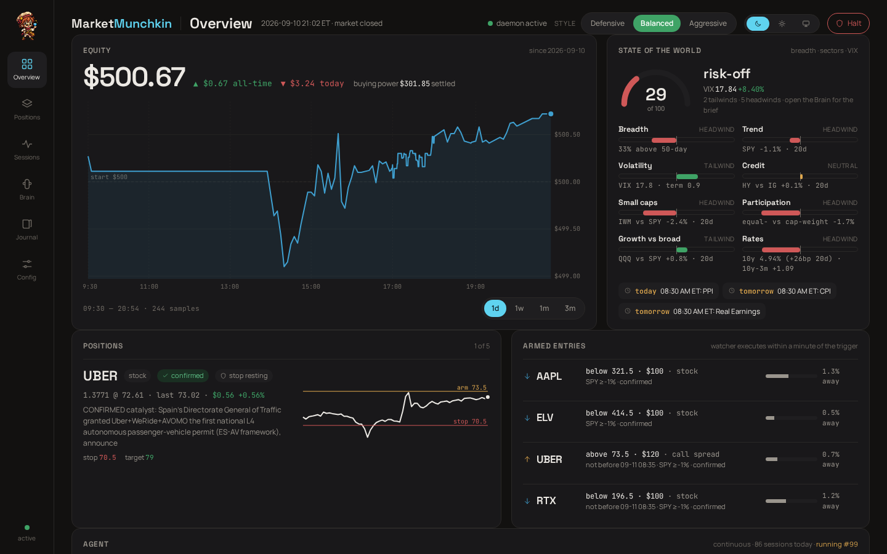
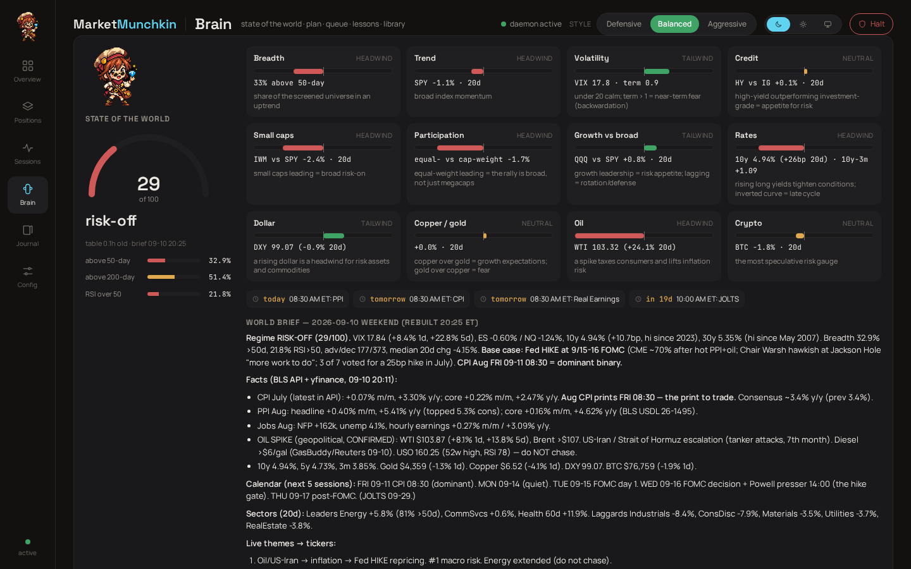
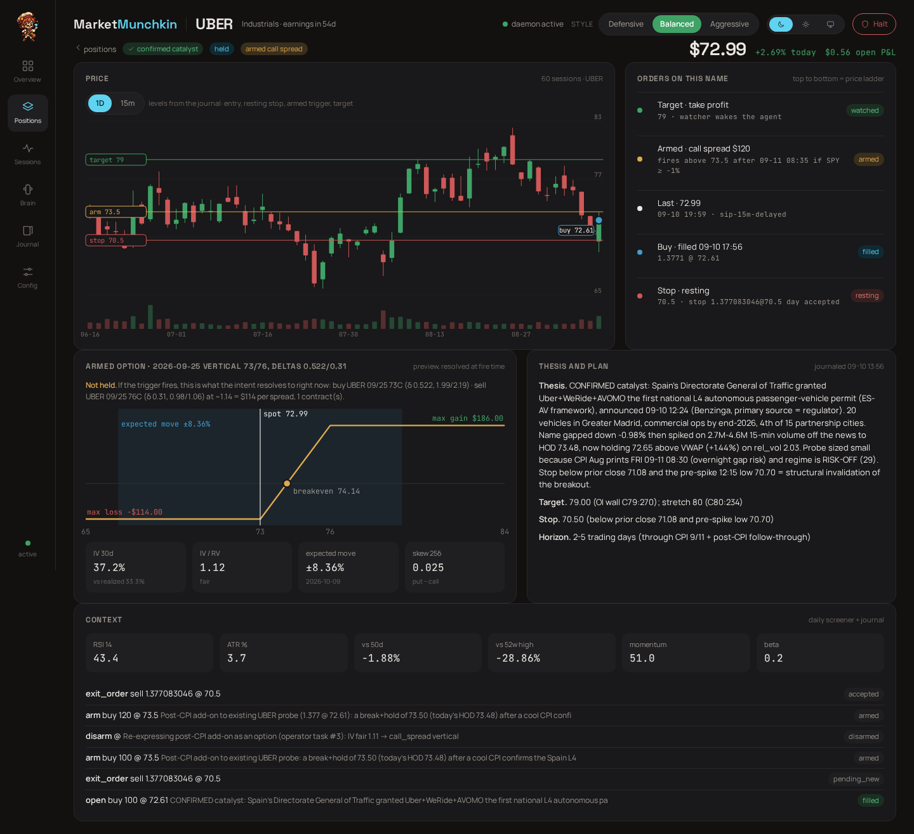
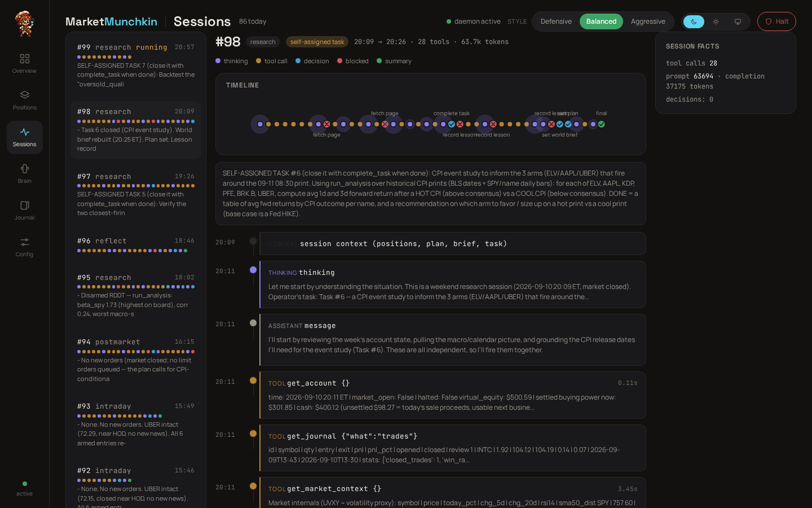
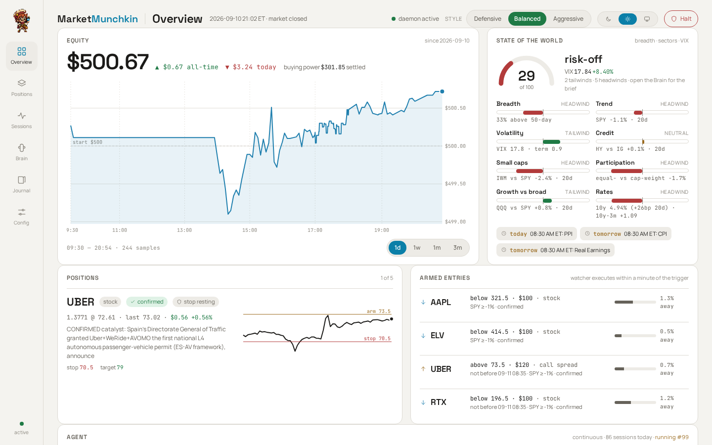
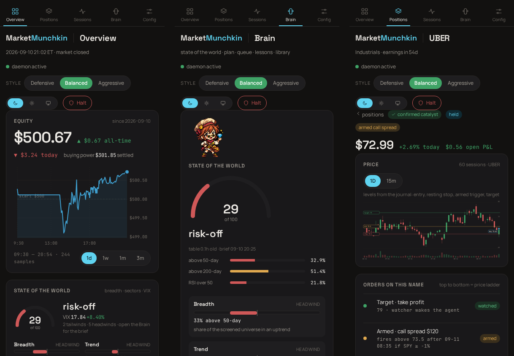
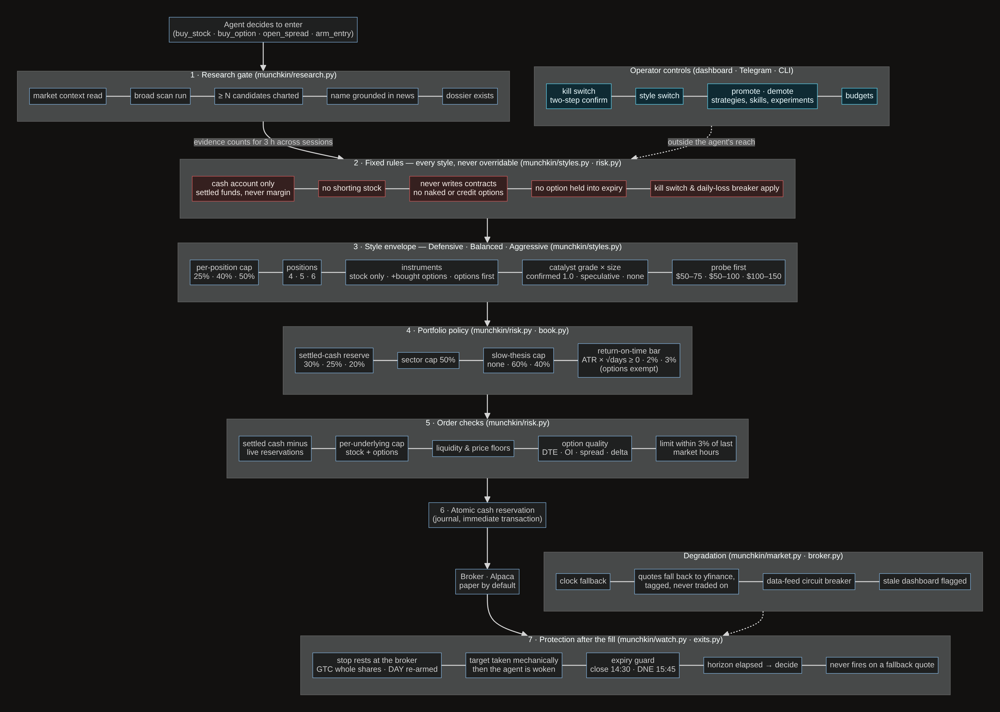
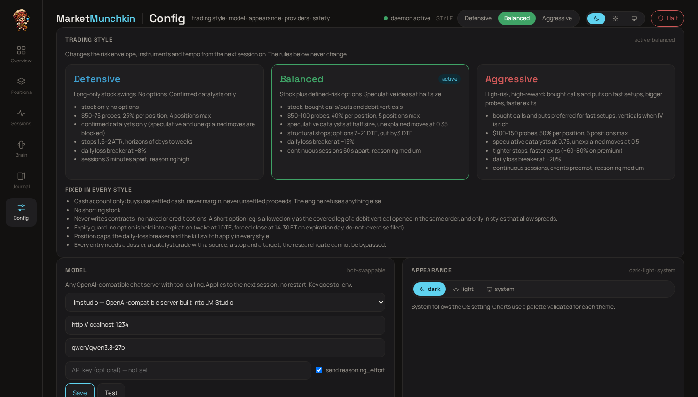

<p align="center">
  
</p>

<p align="center">
  An autonomous trading agent that runs on your own machine, on your own model, in a cash account.<br>
  It reads the world first, trades second, and never uses margin or writes contracts.
</p>

<p align="center">
  <b>Local LLM</b> · <b>Alpaca, paper or live</b> · <b>Cash only</b> · <b>Free data sources</b> · <b>Every decision traced</b> · <b>MIT licensed</b>
</p>



## What it is

MarketMunchkin is a daemon plus a dashboard. The daemon runs an LLM through a tool loop against live market data
many times a day: it rebuilds a picture of the world from primary sources, screens roughly 600 liquid US names,
grades every catalyst by how well it is sourced, and only then places small, stop-protected trades through a
risk engine it cannot talk its way past. Everything it thinks, calls and decides is journaled and drawn on the
dashboard, so you can see why it did what it did.

It started as a "$500 to something" project with a 27B model in LM Studio, wired to an Alpaca paper account to
begin with; the same code drives a live account with one flag. It works with any OpenAI-compatible server that
supports tool calling (LM Studio, Ollama, vLLM, OpenRouter, OpenAI, Anthropic).

## What you see

<table>
  <tr>
    <td width="50%">
      
      <p><b>The Brain.</b> A regime gauge, breadth, and twelve cross-asset dials scored from the 20-day tape (credit, size, participation, rates, dollar, oil, crypto and more), the next scheduled prints and FOMC dates, and the sourced world brief the agent wrote for itself.</p>
    </td>
    <td width="50%">
      
      <p><b>A position.</b> Candles with the journaled entry, resting stop, armed trigger and target drawn on the chart, the order ladder, the option payoff and volatility read, and the thesis with its catalyst grade. Held versus merely armed is always spelled out.</p>
    </td>
  </tr>
  <tr>
    <td width="50%">
      
      <p><b>Sessions.</b> Every run is a ribbon: thinking, tool calls, decisions, rejections, summary. Expand any node for the exact arguments and results. The research gate's refusals show up in red.</p>
    </td>
    <td width="50%">
      
      <p><b>Live, then light, dark, or system.</b> The page re-renders in place whenever the journal changes (server-sent events); no reload needed. Palettes validated for both themes. The style switch is colour-coded: <b>Defensive blue, Balanced green, Aggressive red</b>. The kill switch needs a second click.</p>
    </td>
  </tr>
</table>

<p align="center">
  
</p>

## Guardrails at a glance

Every entry passes the same seven layers in the same order, and the operator's controls sit outside the agent's
reach. The source diagram, the learning-loop diagram and a table of where each rule lives are in
[`docs/guardrails.md`](docs/guardrails.md).



## The rules that never change

These hold in every style and cannot be changed from the dashboard, the prompt, or by the model. They live in
`munchkin/styles.py` and the risk engine, which every order tool calls first.

- **Cash account only.** Buys use settled cash. Never margin, never unsettled proceeds.
- **No shorting stock.**
- **Never writes contracts.** No naked or credit options. A short leg exists only as the covered half of a debit
  vertical opened in the same order, and only where the style allows spreads.
- **No option is held into expiration.** Wake at 1 DTE, forced close at 14:30 ET on expiry day, do-not-exercise filed as a backstop.
- **Position caps, the daily-loss breaker and the kill switch apply everywhere.**
- **Every entry needs a dossier, a graded and sourced catalyst, a stop and a target.** The research gate refuses
  to commit capital until the run has read the market context, run a broad scan, charted several candidates
  and grounded the name in news.

## A brain that reads as much as it writes

The world brief is a versioned document, not an essay rewritten every session: full rebuilds happen pre-market, in
research and post-market; intraday and EVENT runs append sourced developments, and every run is shown what
changed since its previous one. Every entry and armed entry declares what it **depends on** (a driver, a theme, a
sector) and what **invalidates** it; the watcher checks the cross-asset dials hourly and wakes the agent for exactly the
positions whose dependency flipped, and watches the news for each declared theme, not just each held ticker. The one
or two skills and library notes that matter today (a print tomorrow, an option near expiry, the open) are injected
into the prompt in full, so reading them costs nothing. The plan is rewritten only when it changes; a thesis that buys
into a sector the tape has been punishing is asked to say why.

## Portfolio policy and book state

Caps per position were never enough: the book could end fully invested in slow, low-beta names under an aggressive
style with no cash left for the agility the style is about. The risk engine now also enforces a **portfolio policy**
per style, and every run sees the **book state** as data (cash versus reserve, deployable cash, each position's
sector, beta, horizon, age and progress, concentration and style-fit flags, and what the state calls for):

| | Defensive | Balanced | Aggressive |
|---|---|---|---|
| settled-cash reserve | 30% | 25% | 20% |
| sector cap | 50% | 50% | 50% |
| capital in slow theses (> 5 Runs) | no cap | 60% | 40% |
| return-on-time bar for stock entries | none | 2% | 3% |
| first entry into a name (probe) | $50–75 | $50–100 | $100–150 |

The return-on-time bar is the daily ATR times the square root of the holding days: a stock position has to be able to
pay for its holding period, or it is expressed as an option, which is what the aggressive style is for. Duties follow
the state: a book outside its policy gets a rebalance duty (decide what to trim, no new research), a book with no
deployable cash gets a monitor duty, and the opportunity board runs only when there is cash to deploy. The watcher
raises an event when a position's journaled horizon elapses, and the agent must exit or re-thesis in writing.

## Trading styles

Three operator-selected styles change the risk envelope, the instruments, the cadence and the agent's brief.
The active style applies from the next run.

| | Defensive | Balanced (default) | Aggressive |
|---|---|---|---|
| instruments | stock only | stock, bought calls/puts, debit verticals | bought calls/puts first for fast setups; verticals when IV is rich |
| probes | $50–75 | $50–100 | $100–150 |
| per position / positions | 25% / 4 | 40% / 5 | 50% / 6 |
| catalyst grades | confirmed only | speculative ×0.5, unexplained ×0.35 | speculative ×0.75, unexplained ×0.5 |
| options budget | 0% | 60% of equity | 75% of equity |
| daily loss breaker | −8% | −15% | −20% |
| cadence / reasoning | 3 min gap, high | 60 s gap, medium | 60 s gap, events preempt, medium |



## How a day goes

- **Pre-market (08:45 ET).** Top-down: market context, overnight developments, today's data and Fed calendar,
  earnings, geopolitics. The agent rewrites its world brief with sources, reviews news on every holding, and
  sets a plan with concrete triggers.
- **Market hours.** Continuous runs, one starting a minute after the last one ends. A full opportunity board
  (rank, research, arm) runs at most every 30 minutes; the runs in between get a monitor duty: check every held
  and armed name against the tape and news, change something only if a thesis changed. A watcher polls every
  60 seconds and preempts with an **EVENT run** when a resting stop fills, a target trades, a holding or the
  index moves, headlines land on a position, or an option nears expiry. Operator requests from Telegram jump the queue.
- **Armed entries.** For genuinely conditional entries the agent arms instructions: "UBER call spread, $120, above
  73.50, not before 08:35, only if SPY is not down more than 1%". The watcher runs on its own thread, checks every
  60 seconds regardless of what a run is doing, executes within a minute of the trigger, and resolves option
  contracts at fire time. Triggers must sit within about one daily ATR of the price (the tool reports the distance
  and rough odds of a touch); a setup that is valid at the current price is bought at the signal, not parked below
  it. Every arm that expires or is disarmed leaves an ARM REVIEW note (touched or not, closest approach, drift) that
  the POST-MARKET run reads first.
- **Post-market (16:15 ET).** Grades the day's decisions against their theses, records lessons, revises the
  playbook if a rule should change, writes tomorrow's plan.
- **Off hours.** Works its own task queue (research it assigned itself), reflects when the queue is empty, and
  after 20:00 runs at most two bounded **STUDY runs** a night: one curriculum topic (inflation prints, the
  Fed's reaction function, credit spreads, options market structure, event-day patterns, cash-account
  mechanics, and twenty more), six searches and four page fetches at most, written up into a library note that
  every future run can read.

## Under the hood

- **Research gate and catalyst grades.** `confirmed` (primary source or several reputable outlets) sizes at
  1.0, `speculative` at 0.5, `none` (an unexplained move) at 0.35. Grades multiply the position cap. Evidence
  (charts, news, dossiers, scans) is stamped and persisted, and counts for `research_window_hours` (3h) across
  runs, so a run six minutes after the last one does not have to redo the homework to re-arm an idea.
- **State of the world.** A transparent regime score (SPY trend, breadth, VIX level and term structure), sector
  table, macro tape from yfinance, BLS prints from the BLS API, Fed releases from the Fed's RSS, twelve
  cross-asset dials, and the agent's own sourced brief. The prompt tells it to let these direct where it looks.
- **Screener.** S&P 500, Nasdaq-100 and liquid ETFs with indicators, cross-sectional momentum ranks, relative
  strength versus SPY and sector, beta, ADX, squeeze percentile, days to earnings, headline counts, and a
  one-call intraday snapshot with time-of-day-adjusted relative volume. Setup presets carry three-year backtest
  statistics so the model knows which patterns have edge.
- **Options.** Chains with greeks, ATM IV by expiry, IV versus realized, the straddle-implied expected move,
  25-delta skew, open-interest walls, and a stored IV history. Budget-aware contract resolution for singles and
  verticals; spreads are managed on net value.
- **Sandboxed analysis.** `run_analysis` (and skill scripts) let the model run pandas / numpy / scipy / pandas_ta code that runs
  in a separate `python -I -S` interpreter with no credentials, CPU and memory limits, a timeout and an AST
  allowlist.
- **Journal.** SQLite memory: runs with full traces, decisions and rejections, fills, round-trip trades,
  lessons (capped in length), notes, tasks, the plan, the playbook, exits, equity, breadth and IV history.
- **Style switching.** Flipping the style writes one setting. The next run and the watcher pick up the new
  caps, instrument flags, breaker and cadence at once; open positions are never touched, and armed entries are
  checked against the new envelope when they fire rather than resized.
- **Broker outages.** When Alpaca's clock or data backend fails (it has, with the status page green), the clock is
  derived from New York time, quotes fall back to yfinance tagged as such, a circuit breaker fast-fails data calls
  for 90 s instead of every tool waiting 20 s, the dashboard serves its last good snapshot behind a banner, and the
  watcher never opens a position on a fallback quote. Resting stops live at the broker throughout.
- **Watcher.** A separate thread with its own broker, market and journal connections: fills, resting stops,
  targets, moves, headlines, expiry, armed entries, spread management. A fire that overshoots a cap by cents is
  trimmed to fit rather than blocked.
- **Exits.** Every entry carries a numeric stop and target. A protective stop rests at the broker (GTC for whole
  shares, DAY re-armed each morning for fractional shares and options). Targets are taken by the watcher itself
  (`[watch] target_mode = "take"`, `target_take_pct`): stock at market, single options at the bid, verticals as one
  order, then the agent is woken to review; set `target_mode = "wake"` to let the agent decide instead. Stops only
  ever trail up.
- **Context window.** The client asks the serving stack for the context size (LM Studio, Ollama, OpenRouter,
  vLLM) and derives the transcript budget from it, so a smaller model is compacted harder instead of failing.
  Below 32k tokens the Config tab warns you. `LLM_CONTEXT_TOKENS` overrides.
- **Providers, free first.** News queries go to Google News RSS and SearXNG (no keys, no quotas), then Brave
  (2,000 queries a month free, if you add a key), then Tavily (1,000 credits a month, paced per day so a busy
  week cannot drain the month). Identical queries are served from a shared cache for 20 to 60 minutes, and a
  symbol's research dossier is reused within the research window. Finnhub (news, earnings calendar) and
  StockTwits (social buzz) are free too. All managed from the Config tab; keys go to `.env`, never to the model.

## The intraday experiment (shadow-only)

A versioned opening-range continuation experiment runs alongside the agent, in its own thread, and never places orders:
a deterministic detector over completed 5-minute IEX bars, a bounded structured catalyst classifier, three variants
(mechanical, classifier-filtered, options-expressed) with analytical outcomes and cash-constrained $500 / $750 books,
conservative shadow fills, censored outcomes when data is missing, and a risk envelope that can only tighten the
active style. `munchkin experiment --enable | --tick | --report | --signal N`. Design, defaults and limitations:
`docs/intraday-experiment.md`.

## The Lab (phase one)

Claims about the market get a lifecycle instead of a diary entry. A hypothesis is proposed by you (Brain page, or
`/hypo` on Telegram) or by the agent (study and POST-MARKET runs), specified as a trigger, a universe, a horizon
and an expected effect, and tested at night in LAB runs against history **with a control**: an event study
compares the claimed events with every day that met the same mechanical condition regardless of the story; a screen
backtest compares signal days with the unconditional baseline. Gates (`[lab]` in `munchkin.toml`): sample size, edge
over the control, hit-rate edge, agreement between halves of the window, bounded worst case. Rejected claims stay in
the ledger with their numbers and are not re-proposed. Shadow runs, promotion to budgeted strategies and the decision
inbox are the next phases; promotion and demotion are yours alone. The design is in `docs/hypothesis-lab-spec.md`.

## Skills

Skills are packaged procedures the agent loads on demand, in the open Agent Skills format: a folder with a `SKILL.md`
(front matter with `name` and `description`, then the procedure), optional `scripts/*.py` that run in the analysis
sandbox with the same preloaded data as `run_analysis` plus an `ARGS` dict, and optional `resources/` reference files.
Only the index (name and description) sits in the system prompt; bodies load with `load_skill` when the situation
matches, so they cost almost nothing until used.

Six ship in `skills/`: **print-day** (before, at and after a CPI/PPI/payrolls/FOMC release, with an event-study
script), **option-expression** (single versus vertical by IV/RV, strikes, sizing and exits, with payoff arithmetic),
**armed-entries** (triggers, chase limits, time and tape filters), **expiry-and-assignment**, **opening-range** (first
thirty minutes, with a script that reads gap, range, VWAP and relative volume), and **post-trade-review** (grading a
closed trade without overfitting, with a book-statistics script).

The agent can promote a proven procedure with `save_skill`. Those land in `data/skills/` as drafts and only become
active after you approve them on the Brain page, where every skill can also be enabled or disabled. Skills are
instructions, not permissions: the fixed rules and the risk limits live in code and no skill can loosen them, and
skill scripts run in the sandbox without credentials or network.

## Telegram

Alerts to your phone and a command channel, without exposing the dashboard to the internet.

1. Create a bot with @BotFather and paste its token on the Config tab (it goes to `.env` like the other keys).
2. Click "Generate pairing code" and send `/pair CODE` to the bot within ten minutes. Only paired chats are ever
   answered or alerted; everyone else gets "not paired".
3. Run the poller as a service: `cp scripts/munchkin-telegram.service ~/.config/systemd/user/ && systemctl --user enable --now munchkin-telegram`.

What it pushes (each kind can be toggled on the Config tab or with `/notify KIND on|off`): fills, armed entries
firing and stops re-arming; run failures; broker or data-feed degradation and recovery; the pre-market plan and
post-market review. `/mute 60` silences alerts for an hour; replies to your own requests always come through.

Commands: `/status`, `/positions`, `/arms`, `/last`, `/tasks`, `/halt` and `/resume` (each asks you to confirm),
`/style defensive|balanced|aggressive`, `/disarm SYMBOL`, `/notify`. Anything else you type is queued as an
operator request; the next run (within a minute during market hours, within a minute or so off hours) answers
it and the reply lands in the chat.

## Quick start

You need Python 3.12, an Alpaca account with paper trading, and an OpenAI-compatible model server with tool
calling. A SearXNG instance is recommended for search.

```bash
git clone https://github.com/jbpayton/MarketMunchkin && cd MarketMunchkin
uv venv --python 3.12 .venv && uv pip install --python .venv/bin/python -e .
cp .env.example .env && chmod 600 .env   # Alpaca paper keys, model server, SearXNG URL
.venv/bin/munchkin test-llm              # connectivity + tool calling + detected context window
.venv/bin/munchkin status                # account, risk state, positions, plan
.venv/bin/munchkin run --phase intraday --dry-run   # a full run with orders validated but not sent
```

Run the daemon and the dashboard as user services:

```bash
cp scripts/munchkin-daemon.service scripts/munchkin-web.service scripts/munchkin-telegram.service ~/.config/systemd/user/
systemctl --user daemon-reload && systemctl --user enable --now munchkin-daemon munchkin-web munchkin-telegram
journalctl --user -u munchkin-daemon -f
```

The dashboard is at `http://<this-machine>:8787`. Open it from a phone on the same network or over a VPN such
as Tailscale. Do not port-forward it to the internet. Set `MUNCHKIN_WEB_TOKEN` in `.env` to require a token.

### CLI

```bash
munchkin run --phase premarket|intraday|postmarket|research|reflect|study [--dry-run]
munchkin chat "Is NVDA a buy into earnings?"      # read-only Q&A with every research tool
munchkin watch                                     # one watcher tick
munchkin exits [SYMBOL --stop X --target Y]        # show or override exit levels and resting stops
munchkin journal trades|decisions|lessons|Runs|notes
munchkin plan | munchkin playbook
munchkin screener refresh | backtest --years 3 | earnings | regime | intraday --setups
munchkin screener query "rsi14 < 30 and avg_dollar_vol20_m > 50" --sort rsi14 --asc
munchkin skills [--show NAME] [--approve NAME] [--enable NAME] [--disable NAME]   # installed skills
munchkin telegram                                  # the command-channel poller (runs as the munchkin-telegram service)
munchkin notify "text" [--kind fills]              # test a push to the paired chats
munchkin halt | munchkin halt --resume             # block new entries; exits keep working
munchkin baseline --reset                          # re-anchor the virtual account to the broker balance
```

## Configuration

| where | what |
|---|---|
| `.env` | `ALPACA_API_KEY`, `ALPACA_SECRET_KEY`, `ALPACA_PAPER`, `LLM_PROVIDER`, `LLM_BASE_URL`, `LLM_MODEL`, `LLM_API_KEY`, `LLM_CONTEXT_TOKENS`, `SEARXNG_URL`, `TAVILY_API_KEY`, `FINNHUB_API_KEY`, `TELEGRAM_BOT_TOKEN`, `MUNCHKIN_WEB_TOKEN` |
| `munchkin.toml` `[llm]` | reasoning effort per phase, tool budget, transcript budget |
| `munchkin.toml` `[risk]` | starting capital, caps, catalyst multipliers, option DTE / OI / spread filters, research gate (`research_min_charts`, `research_window_hours`) |
| `munchkin.toml` `[schedule]` `[watch]` | session times, cadence, wake thresholds, expiry guard, off-hours windows, study mode |
| `data/llm.json`, `data/search.json` | dashboard overrides for the model and the provider chain (no restart needed) |
| `data/telegram.json`, `data/skills.json` | paired chats and alert toggles; skill enable/approve state |
| `skills/`, `data/skills/`, `data/knowledge/` | operator skills, agent-written skill drafts, the study library |
| dashboard Config tab | trading style, model, appearance, providers, kill switch |

## Code map

| module | what it does |
|---|---|
| `agent.py` | prompts per phase, the system prompt (rules, style, dials, skills, library, playbook, lessons), run loop |
| `tools.py` | the ~55 tools the model sees: account, quotes, charts, screener, options, news, macro, research, orders, exits, arms, journal, skills, analysis |
| `risk.py`, `styles.py` | the risk engine and the three style envelopes over the fixed rules |
| `llm.py` | OpenAI-compatible tool loop, context-window detection, compaction |
| `cli.py` | the `munchkin` CLI: daemon loop (runs, watcher, duties, study), web, telegram, screener, journal |
| `watch.py`, `entries.py`, `exits.py`, `optentry.py` | the watcher, armed entries, resting stops and targets, option contract resolution and spreads |
| `market.py`, `broker.py`, `macro.py`, `providers.py`, `search.py` | Alpaca data and trading, yfinance/BLS/Fed, Tavily/Finnhub/StockTwits, SearXNG, the feed breaker |
| `screener.py`, `analytics.py`, `indicators.py` | the universe table, regime, breadth, sectors, setups and backtests |
| `research.py`, `knowledge.py`, `skills.py` | the research gate, the study library, the skills store |
| `journal.py` | SQLite memory: runs, traces, decisions, fills, trades, lessons, tasks, exits, equity, history |
| `web.py`, `ui/` | the dashboard API and the single-page app |
| `telegram.py` | alerts and the command channel |
| `sandbox/` | the interpreter that runs model-written analysis and skill scripts |

## Security notes

- The model has no file, shell or environment tool. Credentials live in `.env` (mode 600, gitignored) and every
  tool result is scrubbed for the key strings before the model sees it.
- The sandbox for model-written code runs in a separate interpreter with a clean environment and resource limits.
- The dashboard has no authentication beyond an optional token. Keep it on your LAN or VPN.

## Going live

Point `.env` at live keys with `ALPACA_PAPER=false` and review the limits in `munchkin.toml`. The same risk engine,
daemon and journal apply. Starting in the Defensive style and letting the journal fill up for a few weeks is a
sensible way in.

## License

MIT. See [LICENSE](LICENSE).

## Disclaimer

MarketMunchkin is software, not financial advice. Its author is not a registered investment adviser or
broker-dealer, and nothing in this repository is a recommendation to buy or sell anything.

- Trading stocks and options involves risk of loss. Options can expire worthless. Past performance of the
  software, the strategies it finds, or any backtest it shows is no guarantee of future results.
- The decisions are made by a language model. Language models make mistakes and can be confidently wrong. The
  risk engine bounds what a bad decision can cost; it does not make decisions good.
- Market data comes from free third-party sources that can be delayed, wrong or unavailable.
- The software is provided "as is", without warranty of any kind. The authors and contributors accept no
  liability for any loss arising from its use. You are responsible for any account you connect to it and for
  complying with your broker's terms and the laws that apply to you.
