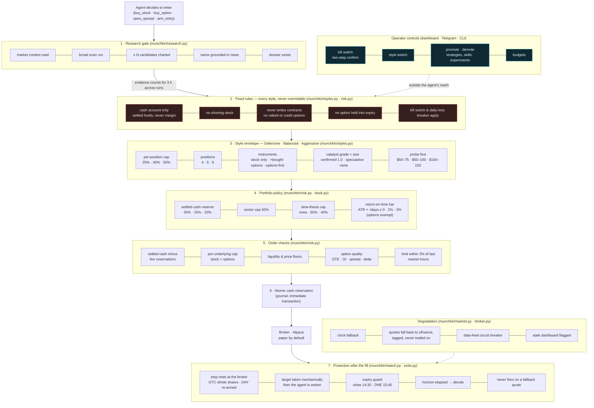
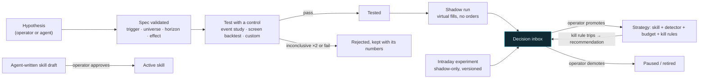

# Guardrails and rules

Every order the agent wants to place passes through the same layers, in this order. The agent cannot skip a layer,
and the operator's controls sit outside the loop entirely. Rendered copy: `docs/guardrails.png`.

## The learning loop has its own gates

Claims, skills and strategies are separate objects with separate lifecycles; nothing in them can loosen a layer above.

## Where each rule lives

| rule | enforced in | changeable by |
|---|---|---|
| cash only, no margin, no shorting, never writes contracts, no option into expiry | `risk.py`, `optentry.py`, `exits.py` | nobody at runtime |
| kill switch, daily-loss breaker | `risk.py`, HALT file | operator (switch), style (threshold) |
| position caps, positions, instruments, catalyst multipliers, probes | `styles.py` → `risk.py` | operator via style switch |
| cash reserve, sector cap, slow-thesis cap, return-on-time | `styles.py` → `risk.policy_checks` | operator via style switch |
| research gate | `research.py` | `munchkin.toml [risk]` |
| settled cash minus reservations, per-underlying cap, liquidity, option quality | `risk.py`, `journal.reserve` | `munchkin.toml [risk]` |
| stops, mechanical targets, expiry guard, horizon events, no fires on fallback quotes | `watch.py`, `exits.py` | `munchkin.toml [watch]` |
| degradation fallbacks | `market.py`, `broker.py`, `web.py` | none needed |
| skills, strategies, experiments | `skills.py`, `lab.py`, `experiments.py` | operator approval only |
